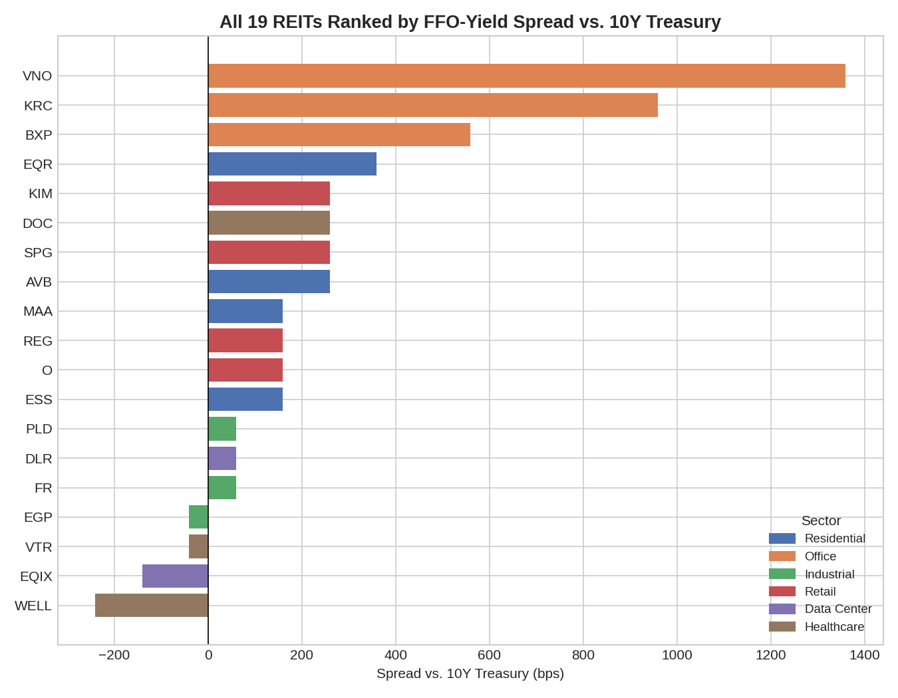
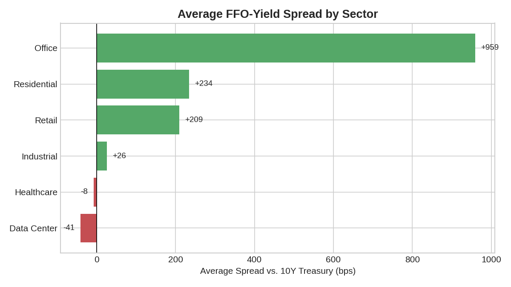
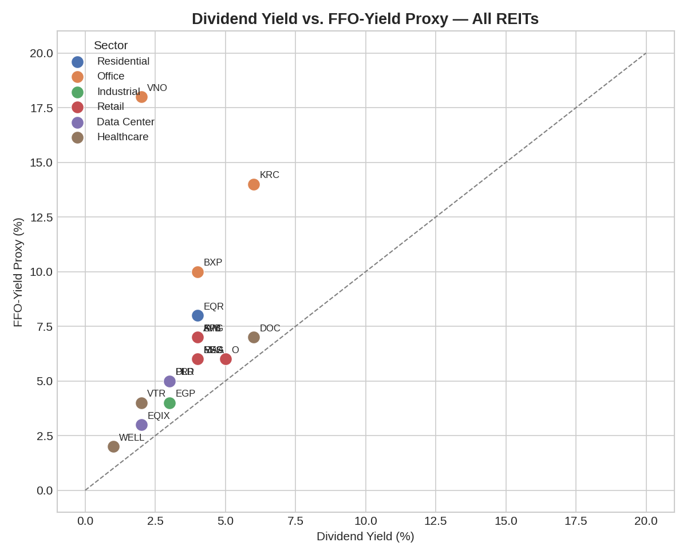

 # REIT Cap Rate Spread Model
### Public real estate as an asset class — tracking the spread between REIT yields and the 10-Year Treasury

  

## Overview

Real estate investors live and die by one comparison: is property income compensating me enough relative to what I could earn risk-free? That comparison — the spread between a REIT's yield and the 10-Year Treasury — is the most-watched signal in real estate investing, and it currently sits near the bottom of its 60-year historical range, meaning real estate is priced expensive relative to bonds by historical standards.

This project builds that signal from scratch using public market data across 19 REITs in 6 property sectors, and goes a step further than most public dividend-yield screeners by using an FFO-yield proxy — a closer stand-in for true cap rates — and by ranking every individual REIT against the full universe rather than relying on sector averages, which this analysis shows can actively mislead.

## Key Findings

- **Vornado (VNO) is the most extreme distress signal in the entire universe** — an 18% FFO yield against a 2% dividend yield implies an ~11% payout ratio, the lowest of any name analyzed. The market is pricing in significant cash-flow risk, not offering a clean bargain.
- **Healthcare's sector average (-8 bps) hides a sector that is actually bimodal**: Healthpeak (DOC) trades cheap (+259 bps, 86% payout) while Welltower (WELL) trades rich (-241 bps, 50% payout) — the two extremes of the entire 19-name dataset, both labeled "Healthcare."
- **Residential is the most internally consistent sector** — all four names (AVB, EQR, MAA, ESS) cluster within a 200 bps band and payout ratios of 50-67%, signaling market consensus on a stable risk profile.
- **Office shows the widest average spread (+959 bps) but for structural, not opportunistic, reasons** — price compression from remote-work concerns mechanically inflates FFO yield; a high spread here reflects priced-in risk, not an obvious bargain.
- Sector-level averaging conceals more than it reveals for Office and Healthcare specifically — individual-ticker ranking is necessary to see the real story.

## REIT Universe Analyzed

| Sector | Tickers | Count |
|---|---|---|
| Residential | AVB, EQR, MAA, ESS | 4 |
| Office | BXP, VNO, KRC | 3 |
| Industrial | PLD, FR, EGP | 3 |
| Retail | O, SPG, REG, KIM | 4 |
| Data Center | DLR, EQIX | 2 |
| Healthcare | WELL, VTR, DOC | 3 |

## What This Project Measures

| Metric | Formula | What it tells you |
|---|---|---|
| Dividend yield | Annual dividend / share price | Cash distributed to shareholders, as a % of price |
| FFO-yield proxy | (Net Income + D&A) / market cap | Closer estimate of true cash-generating yield — adds back the non-cash depreciation that distorts REIT earnings |
| Spread (bps) | REIT yield − 10Y Treasury yield | The risk premium real estate offers over the risk-free rate |
| Payout ratio | Dividend yield / FFO-yield | What share of generated cash flow is actually distributed — the sustainability check |

## Full Ranked Results

All 19 REITs, ranked by FFO-yield spread vs. a 4.41% 10-Year Treasury yield (widest spread = cheapest-looking, narrowest/negative = richest-looking):

| Rank | Ticker | Sector | Div Yield | FFO Yield | Spread (bps) | Payout Ratio |
|---|---|---|---|---|---|---|
| 1 | VNO | Office | 2% | 18% | +1,359 | 11% |
| 2 | KRC | Office | 6% | 14% | +959 | 43% |
| 3 | BXP | Office | 4% | 10% | +559 | 40% |
| 4 | EQR | Residential | 4% | 8% | +359 | 50% |
| 5 | SPG | Retail | 4% | 7% | +259 | 57% |
| 5 | KIM | Retail | 4% | 7% | +259 | 57% |
| 5 | DOC | Healthcare | 6% | 7% | +259 | 86% |
| 8 | AVB | Residential | 4% | 7% | +259 | 57% |
| 9 | MAA | Residential | 4% | 6% | +159 | 67% |
| 9 | ESS | Residential | 4% | 6% | +159 | 67% |
| 9 | O | Retail | 5% | 6% | +159 | 83% |
| 9 | REG | Retail | 4% | 6% | +159 | 67% |
| 13 | PLD | Industrial | 3% | 5% | +59 | 60% |
| 13 | FR | Industrial | 3% | 5% | +59 | 60% |
| 13 | DLR | Data Center | 3% | 5% | +59 | 60% |
| 16 | EGP | Industrial | 3% | 4% | -41 | 75% |
| 16 | VTR | Healthcare | 2% | 4% | -41 | 50% |
| 18 | EQIX | Data Center | 2% | 3% | -141 | 67% |
| 19 | WELL | Healthcare | 1% | 2% | -241 | 50% |

## Results — Visualized

*The notebook generates these as interactive Plotly charts when run live; the images below are exported snapshots for direct viewing on GitHub.*

**All 19 REITs, ranked by FFO-yield spread vs. the 10-Year Treasury:**



**Sector averages — and why they can mislead** (note Healthcare's near-zero average, despite containing both the cheapest-looking and richest-looking names in the dataset):



**Dividend yield vs. FFO-yield proxy** — points far above the diagonal (VNO, KRC, BXP) retain much more cash than they distribute, consistent with conservative/defensive payout policy during a period of price pressure:



## Methodology

1. Pulled price, dividend yield, market cap, and income-statement data for 19 REITs across 6 property sectors via `yfinance`
2. Pulled the 10-Year Treasury yield from FRED's public CSV endpoint (no API key required)
3. Built an FFO-yield proxy (`Net Income + D&A`, divided by market cap) as a closer stand-in for true cap rates than dividend yield alone
4. Normalized for a `yfinance` data inconsistency where dividend yield is sometimes returned as a decimal and sometimes as a pre-converted percentage — caught during development by sanity-checking results against known market benchmarks
5. Computed spread (REIT yield − Treasury yield) and payout ratio (dividend yield ÷ FFO yield) for every name
6. Ranked across the full universe (not just within sector) to surface names that sector averaging would hide
7. Built an automated outlier check flagging any REIT whose FFO yield exceeds 2x its sector's median, to catch distorted single-period accounting figures before they skew conclusions

## Skills Demonstrated

- Financial API integration and data normalization (`yfinance`, FRED public endpoints)
- REIT valuation theory: cap rates, FFO/AFFO, payout ratios, and their public-market proxies
- Debugging and validating financial data against real-world benchmarks rather than trusting raw API output
- Cross-sectional ranking analysis and the limitations of sector-level aggregation
- Reproducible research documentation and data visualization (Plotly)

## Honest Limitations

- Dividend/FFO yield are **public market proxies**, not true property-level cap rates (NOI ÷ transaction price). Private market pricing from Green Street/CoStar/NCREIF can diverge meaningfully from public REIT pricing, especially at cycle turning points.
- The FFO-yield proxy is simplified (Net Income + D&A) and does not apply the full NAREIT FFO adjustment methodology (e.g., excluding gains on property sales).
- `yfinance` field availability and scaling (decimal vs. percent) varies by version — this project includes a normalization check to handle that inconsistency.
- This is a point-in-time snapshot, not a historical time series — see Next Steps.

## Tools Used

Python · pandas · numpy · yfinance · FRED (public CSV endpoint) · Plotly · Google Colab

## How to Run

```bash
pip install -r requirements.txt
```
Then open `REIT_Cap_Rate_Spread_Model.ipynb` in Google Colab or Jupyter and run all cells.

## Next Steps

- Extend to a historical time series of the spread (quarterly snapshots over 5-10 years) to see how it behaved through 2008, 2020, and the 2022 hiking cycle
- Feed the current spread read into a property-level underwriting model's exit cap rate assumption
- Pull true FFO from company supplemental filings rather than approximating from GAAP net income

## Author

Juan David — Finance & Economics, University of Memphis | CFA Level I Candidate
[LinkedIn](https://www.linkedin.com/in/juan-david-herrera-rojas-475b05281) · [GitHub](https://github.com/juandahr04-create)

---
*This project is for educational and research purposes only and does not constitute investment advice.*
